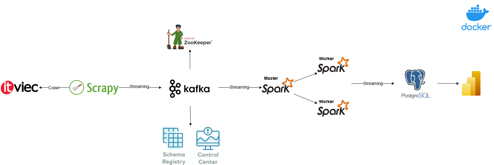
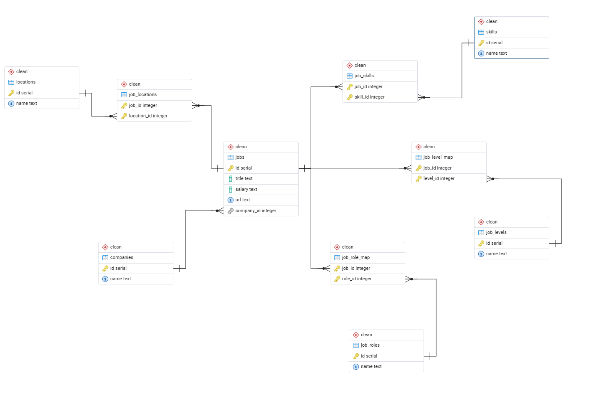

# VN IT Jobs Market Analytics

A data pipeline for collecting, streaming, and analyzing IT job listings from the Vietnamese job market. The project crawls job data from [ITViec](https://itviec.com), streams it through Apache Kafka, and processes it with PySpark before loading into PostgreSQL for analytics.

## Overview

- **Crawler**: Scrapy spider that scrapes IT job postings (title, company, salary, locations, skills, URL) from itviec.com.
- **Streaming**: Job items are published to a Kafka topic and consumed by a Spark Structured Streaming job.
- **Processing**: Spark parses JSON, normalizes skills against a predefined list, and writes to PostgreSQL staging tables (jobs, companies, skills, job_skills, locations, job_locations).
- **Infrastructure**: Docker Compose runs Zookeeper, Kafka (Confluent), Schema Registry, Confluent Control Center, and a Spark cluster (master + worker).
- **Reporting**: Power BI connects to the `clean` schema in PostgreSQL for dashboards and market analytics.

## Architecture



## Prerequisites

- **Docker** and **Docker Compose**
- **Python 3** (for running the Scrapy crawler locally)
- **PostgreSQL** (for Spark to write staging data; default config points to `host.docker.internal:5432/jobdb`)
- **Power BI Desktop** (optional, for opening and editing the report)

## Project Structure

```
vn-it-jobs-market-analytics/
├── crawler/                     # Scrapy project
│   └── crawler/
│       ├── items.py             # JobItem definition
│       ├── pipelines.py         # Kafka producer pipeline
│       ├── settings.py
│       └── spiders/
│           └── itviec_spider.py # ITViec spider
├── schemas/
│   └── jobs_schema.py           # PySpark schema for job JSON
├── sql/                         # PostgreSQL scripts (create tables, insert, mappings)
│   ├── 01_create_staging.sql    # Staging schema + tables
│   ├── 02_create_clean.sql      # Clean schema + tables
│   ├── 03_insert_staging_to_clean.sql
│   ├── 04_insert_lookup_levels_roles.sql
│   ├── 05_insert_job_role_map.sql
│   └── 06_insert_job_level_map.sql
├── dashboards/                  # Power BI dashboard
│   └── itviec.png               # Dashboard screenshot
├── images/                      # Diagrams for README
│   ├── architecture.png
│   └── erd.png
├── jars/                        # Kafka & JDBC JARs for Spark (copy into containers)
├── spark_stream.py              # Spark Structured Streaming job (Kafka → PostgreSQL)
├── docker-compose.yaml         # Kafka, Zookeeper, Schema Registry, Control Center, Spark
├── Dockerfile                   # Spark image with Python deps
└── requirements.txt             # kafka-python, scrapy, pyspark
```

## Quick Start

### 1. Start infrastructure

```bash
docker compose up -d
```

This starts:

- **Zookeeper** (port 2181)
- **Kafka broker** (port 9092)
- **Schema Registry** (port 8081)
- **Confluent Control Center** (port 9021) — UI for topics and consumers
- **Spark Master** (UI: 9090, driver: 7077)
- **Spark Worker**

### 2. Copy JARs to Spark containers

From the project root, copy the contents of the `jars/` folder into the Spark master and worker so they have the Kafka and JDBC connectors:

```bash
docker cp jars/. spark-master:/opt/spark/jars/
docker cp jars/. spark-worker:/opt/spark/jars/
```

To verify the JARs are in place:

```bash
docker exec -it spark-master ls /opt/spark/jars
docker exec -it spark-worker ls /opt/spark/jars
```

### 3. Run the crawler

From the project root, with Kafka running and listening on `localhost:9092`:

```bash
cd crawler
scrapy crawl itviec
```

Scraped items are sent to the Kafka topic `itviec`.

### 4. Run the Spark streaming job

The Spark job reads from the `itviec` topic, applies the schema, extracts skills, and writes to PostgreSQL. Run it inside the Spark cluster (e.g. submit from the `spark-master` container) or adapt for your Spark deployment. Ensure PostgreSQL is reachable (e.g. `host.docker.internal:5432`) and the database `jobdb` and staging schema/tables exist.

Example (from host, if Spark is configured to accept submissions):

```bash
# Example: submit from spark-master container
docker exec -it spark-master /opt/spark/bin/spark-submit \
  --master spark://spark-master:7077 \
  /opt/spark-jobs/spark_stream.py
```

Adjust paths and master URL to match your setup.

### 5. Set up the database and run SQL scripts

Create the database (e.g. `jobdb`) and run the SQL scripts in `sql/` **in order**. Run **01** and **02** before the Spark job writes data; run **03–06** after you have data in `staging` (e.g. after at least one Spark run).

| Order | File | Description |
|-------|------|-------------|
| 1 | `01_create_staging.sql` | Create `staging` schema and tables (jobs, companies, skills, job_skills, locations, job_locations) |
| 2 | `02_create_clean.sql` | Create `clean` schema and tables (normalized model + job_levels, job_roles, maps) |
| 3 | `03_insert_staging_to_clean.sql` | Copy data from staging into clean (companies, skills, locations, jobs, job_skills, job_locations) |
| 4 | `04_insert_lookup_levels_roles.sql` | Seed `clean.job_levels` and `clean.job_roles` |
| 5 | `05_insert_job_role_map.sql` | Populate job–role mapping from job titles |
| 6 | `06_insert_job_level_map.sql` | Populate job–level mapping from job titles |

Example (from project root). For **PostgreSQL on your machine** use `-h localhost`; if PostgreSQL runs in Docker and you run `psql` from the host, use `-h host.docker.internal`:

```bash
psql -h localhost -U postgres -d jobdb -f sql/01_create_staging.sql
psql -h localhost -U postgres -d jobdb -f sql/02_create_clean.sql
# After staging has data:
psql -h localhost -U postgres -d jobdb -f sql/03_insert_staging_to_clean.sql
psql -h localhost -U postgres -d jobdb -f sql/04_insert_lookup_levels_roles.sql
psql -h localhost -U postgres -d jobdb -f sql/05_insert_job_role_map.sql
psql -h localhost -U postgres -d jobdb -f sql/06_insert_job_level_map.sql
```

### 6. Open the Power BI report

After the database has data in the `clean` schema, open the Power BI report to explore dashboards. Preview:


To open the report in Power BI Desktop: use the `.pbix` file in `dashboards/`, set the data source to your PostgreSQL instance (server e.g. `localhost`, database `jobdb`, schema `clean`). Use **Get data → PostgreSQL**, then select the tables from the `clean` schema.

## Database Schema



## Configuration

- **Kafka (crawler)**: `pipelines.py` uses `bootstrap_servers=['localhost:9092']`. Use the same for local runs; in Docker use the service name (e.g. `broker:29092`).
- **Kafka (Spark)**: `spark_stream.py` uses `broker:29092` (Docker network).
- **PostgreSQL**: In `spark_stream.py`, JDBC URL, user, password, and table names are set for `host.docker.internal` and schema `staging`. Create the database and tables (jobs, companies, skills, job_skills, locations, job_locations) as needed.

## Tech Stack

| Component   | Technology        |
|------------|-------------------|
| Crawling   | Scrapy 2.11       |
| Messaging  | Apache Kafka      |
| Processing | PySpark 3.4 (Structured Streaming) |
| Storage    | PostgreSQL (staging + clean) |
| Reporting  | Power BI                    |
| Runtime    | Docker, Confluent platform, Apache Spark |

